# 基于Springboot的桂林旅游景点导游平台

## Springboot-0068


## 技术栈

Springboot mybatisplus vue mysql maven


## 数据库表(13张)


## 功能介绍

```properties
1、游客：可浏览景点信息以及论坛。
2、普通用户；新用户注册、老用户登陆、浏览旅游景点、旅游线路预订、论坛留言。
3、管理员：用户管理、新闻资讯管理、景点管理、线路管理、预订管理、论坛管理

```


## 图片

### 前台

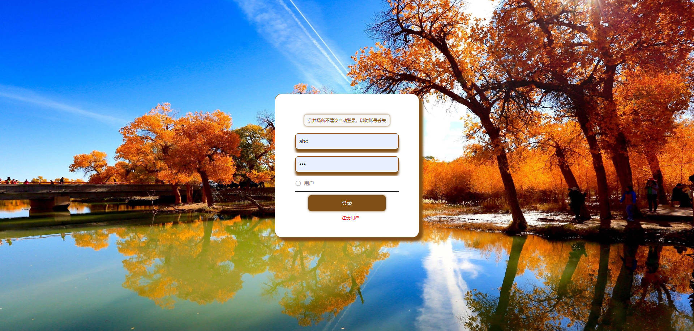

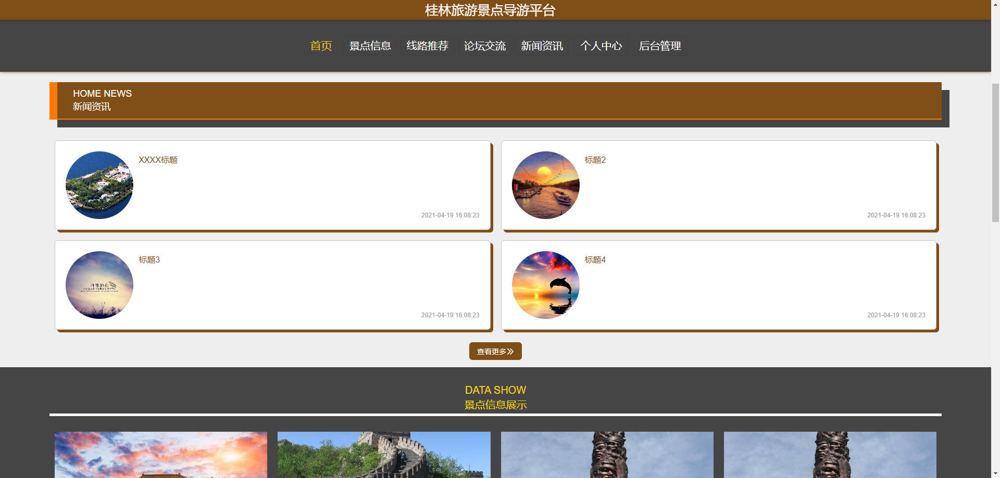


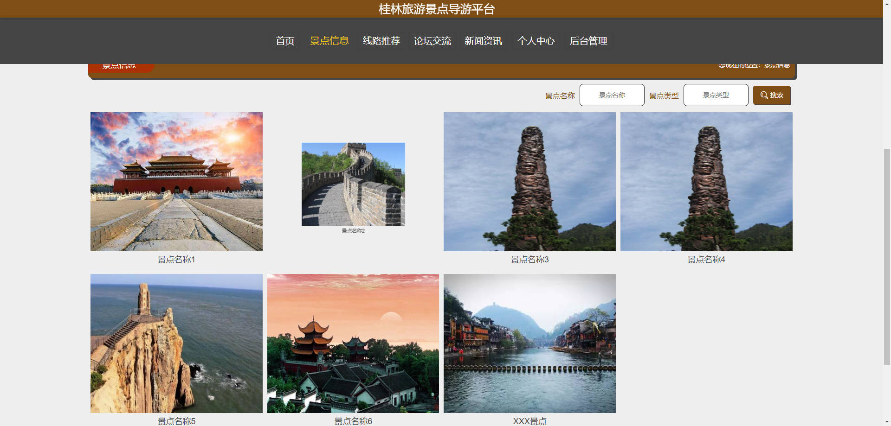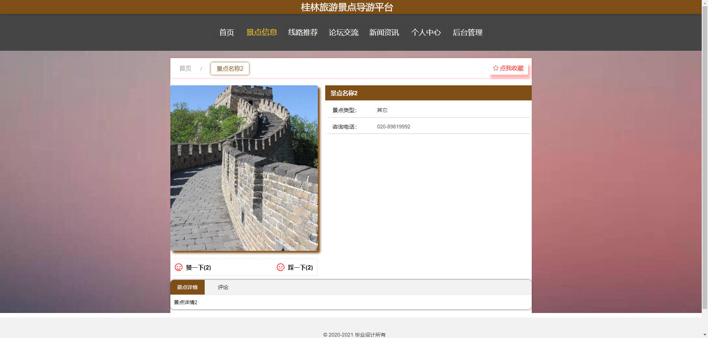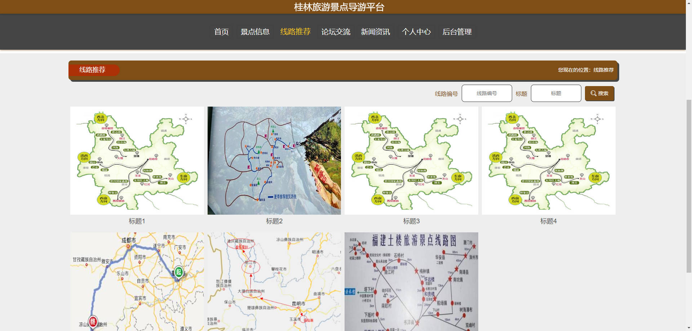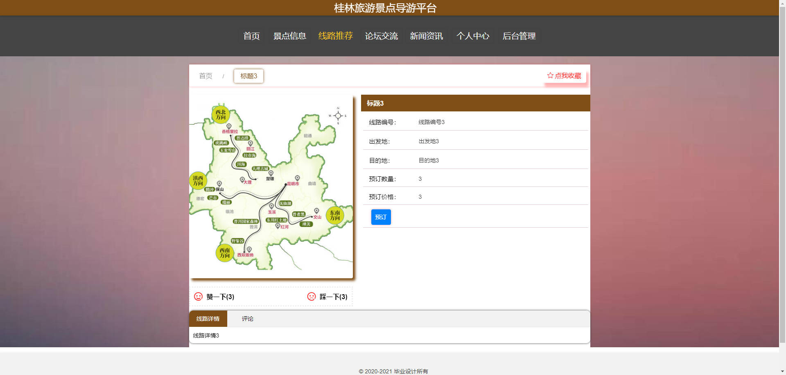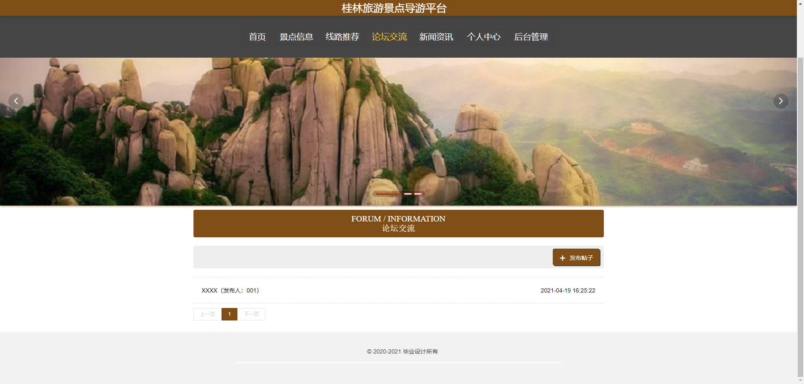

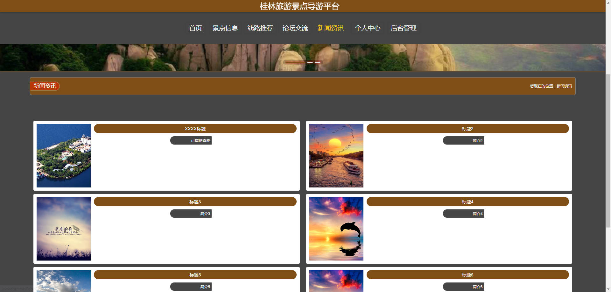

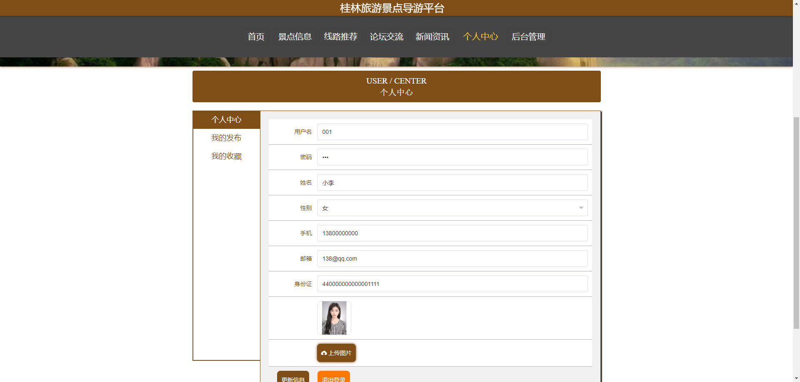

### 后台


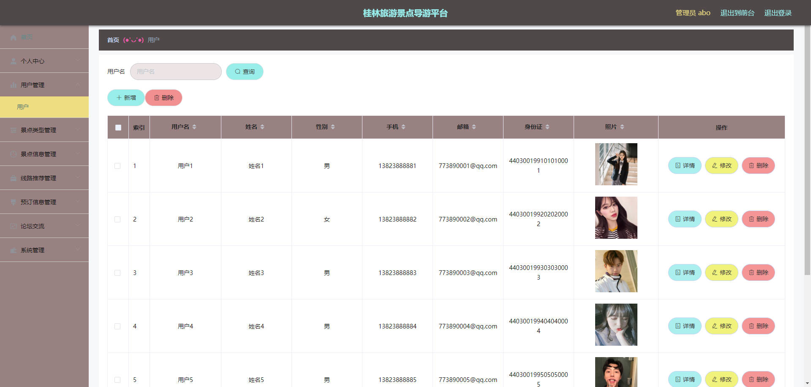

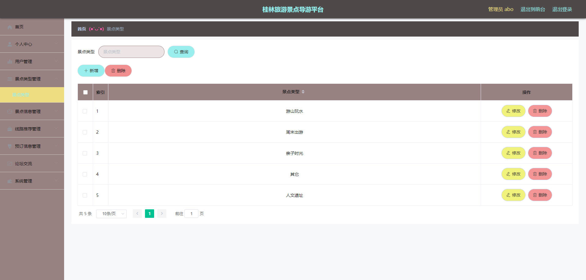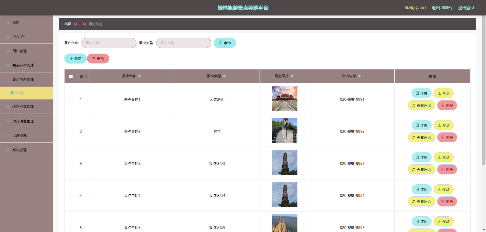

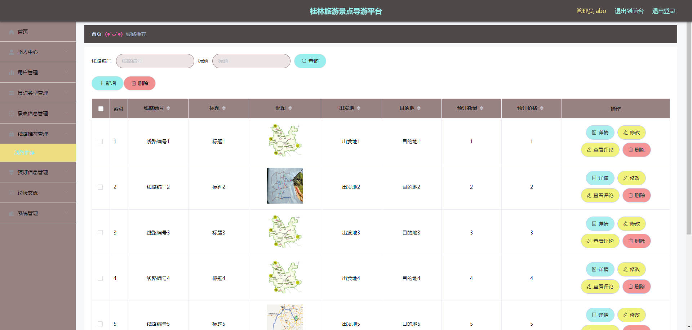

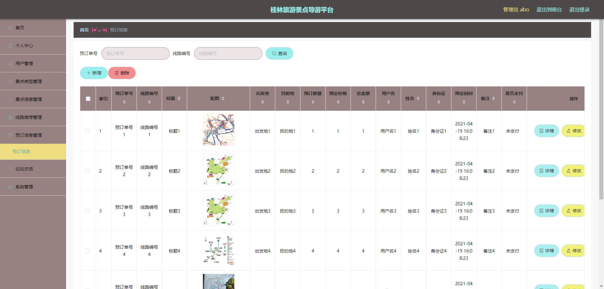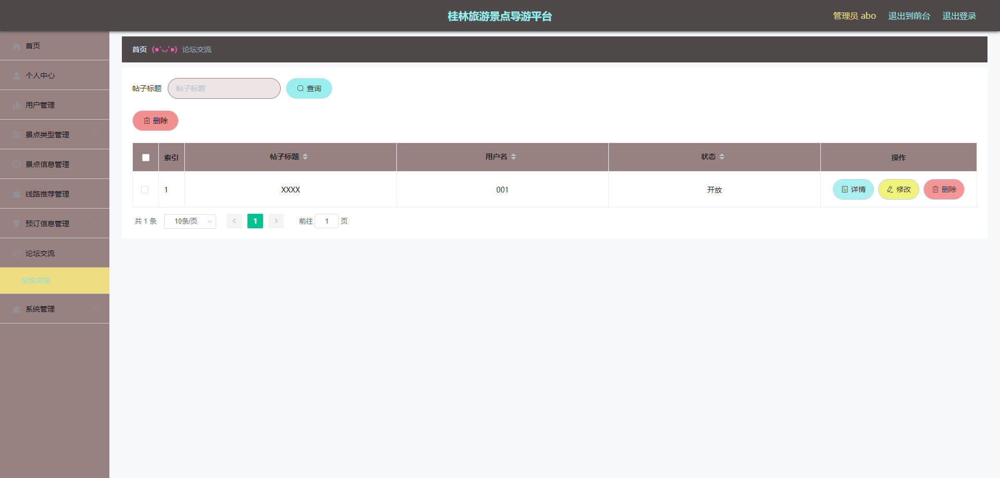


## 访问路径

### 前台

```properties
http://localhost:8080/springbootr6il1/front/pages/login/login.html

账号 001
密码 001
```

### 后台

```properties
http://localhost:8080/springbootr6il1/admin/dist/index.html#/login

账号 abo
密码 abo
```


## 功能图

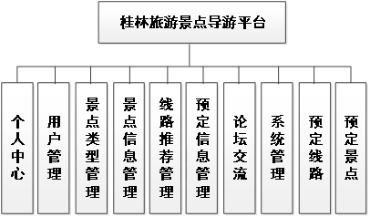


## 文档目录

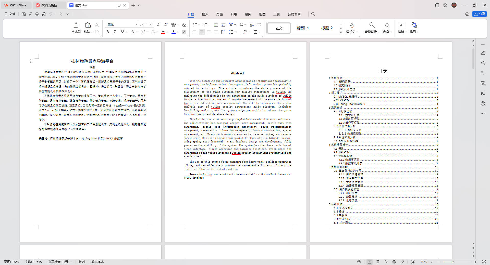


## 打赏或交流


